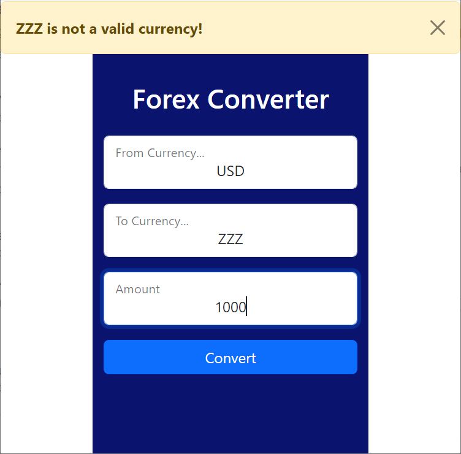

# Forex Converter

## App

Exchanges the amount of one currency into another.
- Supports 171 currencies.

> Built with ***Python***, ***Flask***, and ***Bootstrap*** and powered by ***api.exchangerate.host***

## Validation and Error Handling

- Validation handled on both server-side and client-side. 
- Error messages cleanly display at the top of the app.

## Output

- Output displays on the same page.
- Currency is precisely converted and formatted.
- Safe HTML currency symbols are used.

## Responsive Design

- Responsively built to fit any screen size.

